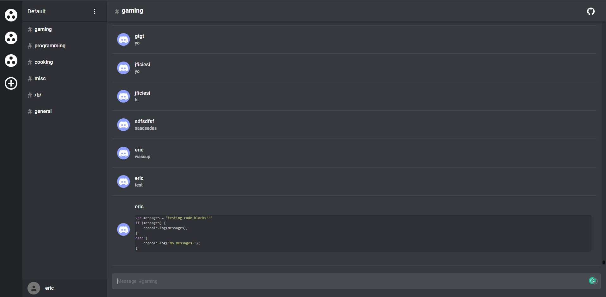

# HuxCord (A HuxBook spinoff which is a Discord clone)
> Functional Discord Clone using React, Socket IO, NodeJS, Express and MySQL

Since HuxBook doesn't have private messaging, I think this should be the sub for it. 

Live Version https://huxtabl8.github.io/huxcord/

API https://github.com/ericellb/React-Discord-API

## Features
  Implemented Features
  - [x] Real time messaging using Socket IO
  - [x] Local Authentication
  - [x] Loads User Data upon login (Servers, Channels, Private Messages)
  - [x] Creation and Joining Servers
  - [x] Creation of Channels in a Server
  - [x] Server Settings (Change name and delete)
  - [x] Channel Settings (Change name and delete)
  - [x] Persistent channel history
  - [x] Pretty Print Code Blocks enclodes in three `
  - [x] Private messaging

  Planned Features
  - [ ] Show current active users in given channel
  - [ ] Reformat how messages are fetched 
      - Fetch messages on channel change
      - Make API return only X results until we ask for more
      - Will help scale once Image uploads are implemented
  - [ ] Voice Chat down the road...

## Owner / Lisence
Copyright Eric Ellbogen 2019

- This project is under the **GNU V3** license. [Find it here](https://github.com/ericellb/React-Discord-Clone/blob/master/LICENSE).
